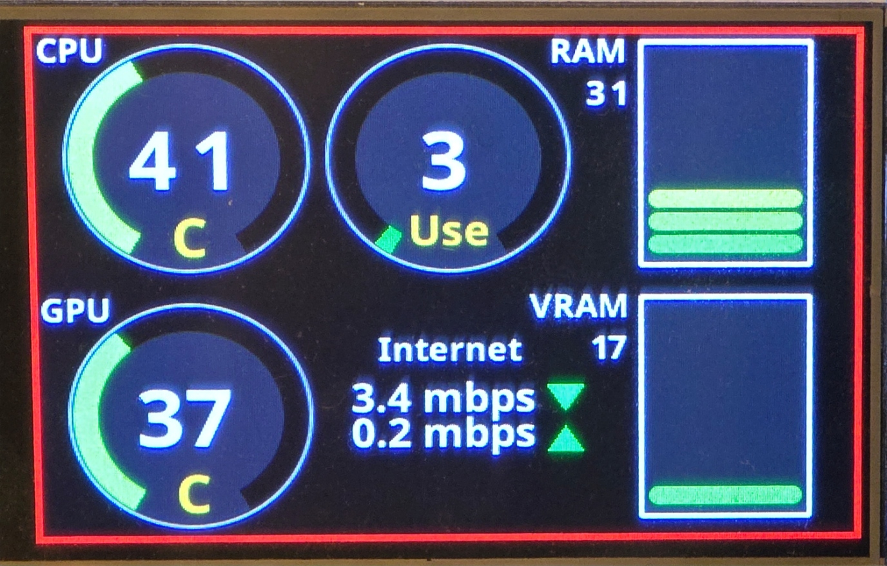

# PicoDisplay

PicoDisplay is a small program that listens to a serial port on a Raspberry Pi Pico and displays system data like CPU and GPU temperatures, RAM usage, and network speeds. It works alongside my Pico Server project to visualize system stats in a compact and useful way.

I'm sharing this in case someone else is working on a similar project and might find it handy! 

Here is how it looks in action:

## Features
- Displays real-time system stats on a small screen.
- Uses a Raspberry Pi Pico with a connected display.
- Custom dials and meters for CPU, GPU, RAM, and more.
- Works seamlessly with the [**Pico Server**](https://github.com/ioiototm/PicoServer) project.

## Setup
- Using Arduino IDE, install the TFT_eSPI library.
- Flash the firmware onto your Raspberry Pi Pico.
- Ensure the correct serial connection is set up.
- Customize the display style and data formatting as needed.

## Related Projects
This works together with my **Pico Server** project, which collects and sends system stats to the Pico. You can find that repo here: [**Pico Server Repo**](https://github.com/ioiototm/PicoServer)

## Libraries Used
This project makes use of the amazing [**TFT_eSPI**](https://github.com/Bodmer/TFT_eSPI) library, which makes handling graphics and display elements super easy. Big shoutout to Bodmer for such a fantastic library! You can check out the full details and license for TFT_eSPI here:
- [TFT_eSPI License](https://raw.githubusercontent.com/Bodmer/TFT_eSPI/refs/heads/master/license.txt)
- [TFT_eSPI Readme](https://raw.githubusercontent.com/Bodmer/TFT_eSPI/refs/heads/master/README.md)

## License & Usage
This project is completely open for anyone to use, modify, or experiment with. No restrictions, no strings attached, just have fun with it! If you end up building something awesome with it, feel free to share. Big thanks to my AI assistant for making sure I don't get lost in my own code. 

